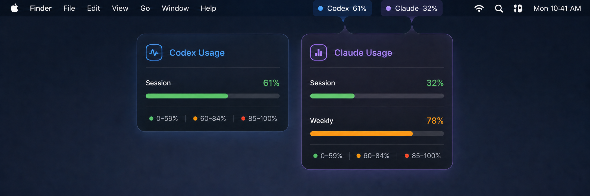
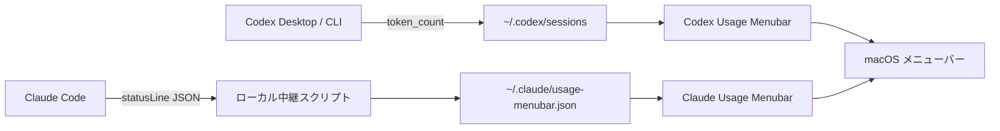

# AI Usage Menubar

<p align="center">
  
</p>

<p align="center">
  
  
  
  <a href="LICENSE"></a>
</p>

CodexとClaude Codeの利用率を、macOSのメニューバーでいつでも確認できる軽量なネイティブアプリです。

`Codex 61%` / `Claude 32%` のように常時表示し、使用率に応じて緑・オレンジ・赤へ変化します。ライト／ダークモードと複数ディスプレイに対応しています。

> 上の画像は実装をもとにした画面イメージです。表示される使用率・期間・モデル名はアカウントと利用状況によって変わります。

## ひと目で分かること

| | Codex | Claude Code |
|---|---|---|
| メニューバー | `Codex 61%` | `Claude 32%` |
| 利用枠 | サブスクリプション枠 | セッション枠・週間枠 |
| 詳細 | リセット時刻、累計トークン、文脈使用率 | リセット時刻、使用モデル |
| データ取得 | ローカルの`token_count`イベント | Claude Codeの`statusLine` |
| 追加API通信 | なし | なし |

## 特長

- Codexのサブスクリプション利用枠、リセット時刻、セッショントークンを表示
- Claude Codeのセッション枠・週間枠とリセット時刻を表示
- 5秒ごとの自動更新
- SF Pro Roundedを使ったmacOSネイティブUI
- APIキー、追加のAPI呼び出し、外部サーバーへの送信なし
- Apple Silicon搭載Mac向けのシンプルなローカルビルド

## 必要なもの

- macOS 13以降
- Xcode Command Line Tools（`xcode-select --install`）
- Codexデスクトップ／Codex CLI
- Claude版を使う場合はClaude Code

## クイックスタート

リポジトリを取得し、両方のアプリをビルドします。

```sh
git clone https://github.com/akh1r0ck/ai-usage-menubar.git
cd ai-usage-menubar
make build
```

ビルド結果は `dist/ChatGPT Usage.app` と `dist/Claude Usage.app` に作成されます。

## Codex版

```sh
./scripts/build-app.sh
open "dist/ChatGPT Usage.app"
```

Codexが `~/.codex/sessions/**/*.jsonl` に記録する `token_count` イベントだけを読み取ります。通常のChatGPT Web／ChatGPTアプリ全体の使用量を表示するものではありません。

## Claude Code版

```sh
./scripts/build-claude-app.sh
python3 scripts/install-claude-capture.py
open "dist/Claude Usage.app"
```

インストーラーは `~/.claude/settings.json` にstatusLineを設定します。既存の設定項目は保持し、別のstatusLineが設定済みの場合は `~/.claude/settings.before-claude-usage.json` にバックアップしてから置き換えます。

設定後、Claude Codeを再起動して1メッセージ送信すると利用率が表示されます。

## 仕組み



どちらも読み取りと表示はMac内で完結します。利用量を確認するための追加APIリクエストは発生しません。

## 色の見方

| 使用率 | 色 | 状態 |
|---:|:---:|---|
| 0–59% | 🟢 | 余裕あり |
| 60–84% | 🟠 | 残量に注意 |
| 85–100% | 🔴 | 上限が近い |

## 複数ディスプレイ

「システム設定」→「デスクトップとDock」→「Mission Control」→「ディスプレイごとに個別の操作スペース」をオンにし、一度ログアウトしてください。各画面のメニューバーに使用率が表示されます。

## 自動起動

ビルドしたアプリを任意の場所へ移し、「システム設定」→「一般」→「ログイン項目」に追加してください。

## 開発

```sh
make build
make check
```

アプリはObjective-CとAppKitで実装しており、外部ライブラリには依存していません。生成された `.app` は `dist/` に置かれ、Gitには含まれません。

### プロジェクト構成

```text
.
├── Sources/       # Codex版・Claude版のAppKit実装
├── Resources/     # 各アプリのInfo.plist
├── scripts/       # ビルドとClaude statusLine設定
├── docs/images/   # README用画像
├── Makefile
└── README.md
```

## プライバシー

処理はすべてMac内で完結します。会話本文の表示、保存、外部送信は行いません。Codex版は利用量イベント、Claude版はstatusLineから受け取った利用率情報だけを使用します。

## 注意事項

このプロジェクトは非公式であり、OpenAIおよびAnthropicとは提携していません。各製品のローカルデータ形式やstatusLine仕様の変更により、表示できなくなる可能性があります。

## License

[MIT License](LICENSE)
